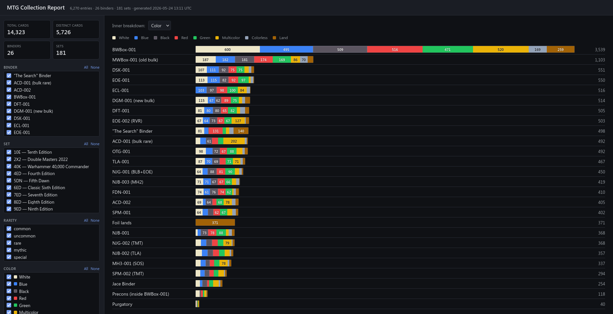

# ManaBox Collection birdview

## What is it

The main idea behind this script is to get the way to manage my ManaBox MTG collection from a bird view. It is hard to figure out how the card distributed in boxes and binders (in terms of color, rarity and set) from the ManaBox interface, so I wrote this visualisator. It takes CSV export from ManaBox and renders a static HTML with needed information.

## Usage

- Import CSV from your ManaBox (by default it uses name `ManaBox_Collection.csv`)
- Install needed requirements from `requirements.txt`
- Run `python report.py`
- Open resulted `collection_report.html` in browser

## Useful docs

- [spec.md](spec.md) - project specification
- [CLAUDE.md](CLAUDE.md) - implementation instructions for Claude Code (but can be useful for humans too)
- [collection_report.html](./examples/collection_report.html) - sample report
